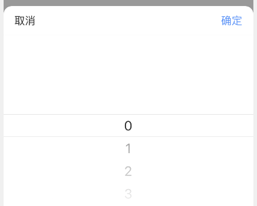
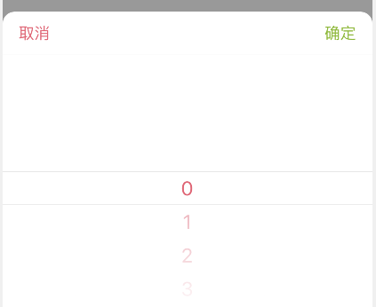
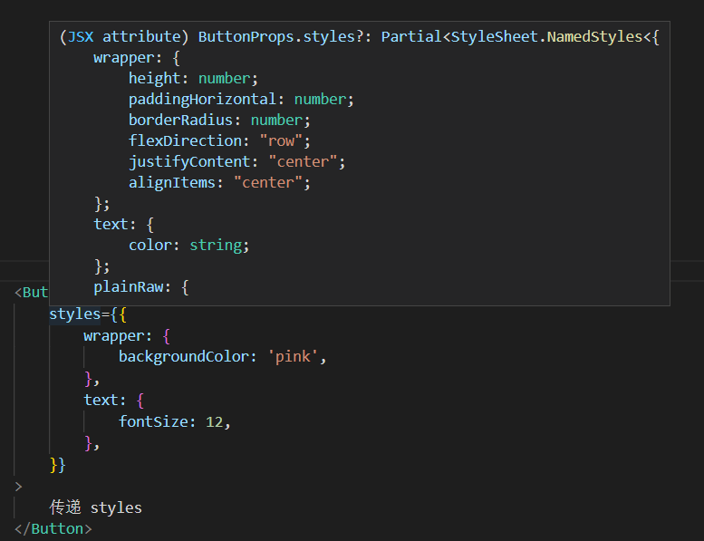
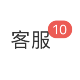
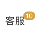

# 主题

内部提供了 3 种方式重置组件的样式：

- 全局主题变量

- 全局组件级 styles

- 局部组件 styles

## 全局主题变量

全局主题，主要划分为**基础**与**组件级**主题

### 基础主题变量

组件提供了一些默认的基础主题变量

|           | 变量名                                                         | 值                               |
| --------------- | ------------------------------------------------------------ | ---------------------------------- |
| Main          | `color_primary`                             | `'#4794ff'`                           |
|           | `color_regular`                             | `'#ff4d88'`                           |
|           | `color_info`                             | `'#666'`                           |
|           | `color_mark`                             | `'#ff4d4d'`                           |
|           | `color_white`                             | `'#fff'`                           |
|           | `color_black`                             | `'#000'`                           |
| Text          | `color_text_primary`                             | `'#323232'`                           |
|           | `color_text_regular`                             | `'#999'`                           |
|           | `color_text_secondary`                             | `'#b5b5b5'`                           |
|           | `color_text_placeholder`                             | `'#b2b2b2'`                           |
| Disabled          | `disabled_text_color`                             | `'#ccc'`                           |
|           | `disabled_background`                             | `'#ddd'`                           |
| MaskGradient          | `color_text_thin_dark_1`                             | `'rgba(0, 0, 0, .1)'`                           |
|           | `color_text_thin_dark_2`                             | `'rgba(0, 0, 0, .2)'`                           |
|           | `color_text_thin_dark_3`                             | `'rgba(0, 0, 0, .3)'`                           |
|           | `color_text_thin_dark_4`                             | `'rgba(0, 0, 0, .4)'`                           |
|           | `color_text_thin_dark_5`                             | `'rgba(0, 0, 0, .5)'`                           |
|           | `color_text_thin_dark_6`                             | `'rgba(0, 0, 0, .6)'`                           |
|           | `color_text_thin_dark_7`                             | `'rgba(0, 0, 0, .7)'`                           |
|           | `color_text_thin_dark_8`                             | `'rgba(0, 0, 0, .8)'`                           |
|           | `color_text_thin_dark_9`                             | `'rgba(0, 0, 0, .9)'`                           |
| Border          | `border_color_base`                             | `'#e8e8e8'`                           |
|           | `border_color_dark`                             | `'#cecece'`                           |
| Background          | `background_color_base`                             | `'#f2f2f2'`                           |
|           | `background_color_light`                             | `'#f5f5f5'`                           |
|           | `background_color_dark`                             | `'#ebebeb'`                           |
| FontSize          | `font_size_XXS`                             | `11`                           |
|           | `font_size_XS`                             | `12`                           |
|           | `font_size_S`                            | `13`                           |
|           | `font_size_M`                             | `14`                           |
|           | `font_size_L`                             | `15`                           |
|           | `font_size_XL`                             | `16`                           |
|           | `font_size_XXL`                             | `17`                           |
|           | `font_size_XXXL`                             | `18`                           |
|           | `font_size_XXXXL`                             | `20`                           |
| ZIndex          | `z_index_negative`                             | `-1`                           |
|           | `z_index_S`                             | `1`                           |
|           | `z_index_M`                             | `10`                           |
|           | `z_index_L`                             | `100`                           |
|           | `z_index_XL`                             | `100`                           |
| Device          | `iphoneX_bar_height`                             | `34`                           |

### 组件级主题变量

除了基本的主题变量外，每个组件都拥有各自的**组件级主题变量**，通常以 c_ 为前缀（如 c_button_xxx）

变量名详见各组件文档中**主题变量**小节（如 [Button 主题变量](/rn-components/general/button#theme)）

当我们需要全局替换主题变量时，只需要引入 `ThemeProvider` 即可：

```tsx | pure
import { ThemeProvider } from '@kealm/rn-components';

export default () => {
    return (
        <ThemeProvider
            value={{
                color_text_primary: '#f05b72', // 替换基础文本色
                c_picker_btn_ok_text_color: '#7fb80e', // 替换 Picker 确认按钮颜色
            }}
        >
            {/*  */}
        </ThemeProvider>
    );
};
```

变更前：



变更后：



```tsx
/**
 * inline: true
 */
import React from 'react';
import { Link } from 'react-router-dom';
import { Blockquote } from '@kealm/react-packages';

export default () => (
  <Blockquote type='warning' title='WARNING'>
    <p>请将 ThemeProvider 放置页面最外层（PortalWrapper 之上），防止某些组件经过 Portal 提取层级后覆盖不到</p>
  </Blockquote>
);
```

## RN 样式的覆盖局限性

RN 中通常使用 `StyleSheet.create` 为每个组件创建 styles 对象，例如下组件：

```tsx | pure
const styles = StyleSheet.create({
    wrapper: {
        // ...
    },
    content: {
        // ...
    },
    text: {
        // ...
    },
});

const Button = () => {
    return (
        <View style={styles.wrapper}>
            <View style={styles.content}>
                <Text style={styles.text}>...</Text>
            </View>
        </View>
    );
};
```

在 H5 中，**我们可以很轻松的使用 CSS 选择器，重置组件中任意 DOM 节点的样式，但在 RN 却无法做到这种效果**

在 RN 中，需要接收 props 中的 style 样式传递给对应节点才能实现样式的重置，这在对组件进行某个节点覆盖样式上造成了不便

## 什么是 styles？

在这里，几乎每个组件都提供了 **props.styles** 配置，它可以传递该组件中用到的全部 style 项，并与默认 styles 进行 **mixin 混合**

例如 `Button` 组件，它的 styles 组成结构为：

```ts
StyleSheet.create({
    wrapper: {},
    text: {},
    // plain
    plainRaw: {},
    // type
    primaryRaw: {},
    primaryPlainBorderRaw: {},
    primaryPlainTextRaw: {},
    regularRaw: {},
    regularPlainBorderRaw: {},
    regularPlainTextRaw: {},
    infoRaw: {},
    infoPlainBorderRaw: {},
    infoPlainTextRaw: {},
    // size
    largeRaw: {},
    largeTextRaw: {},
    // disabled
    disabledRaw: {},
    disabledTextRaw: {},
    disabledPlainRaw: {},
    disabledPlainTextRaw: {},
});
```

那么诸如 wrapper、text、plainRaw 等都是 Button 的 `styles` 可选项



（图例中，wrapper、text 将与原 styles 进行合并）

```tsx
/**
 * inline: true
 */
import React from 'react';
import { Link } from 'react-router-dom';
import { Blockquote } from '@kealm/react-packages';

export default () => (
  <Blockquote type='warning' title='WARNING'>
    <p>props.styles 主要在于与 <b>默认 styles 混合，而非覆盖</b></p>
  </Blockquote>
);
```

## 全局组件级 styles

通过上个小节可知，除了全局主题变量外，每个组件都提供了 Provider 为该组件扩展全局可配置的 `styles`

如下，为全局的 `Badge` 更换小红点色值

```tsx | pure
import React from 'react';
import { View } from 'react-native';
import { Text, Badge, BadgeStylesProvider } from '@kealm/rn-components';

export default () => {
    return (
        <BadgeStylesProvider
            value={{
                count: {
                    backgroundColor: '#dea32c', // 全部更新 Badge 组件的 styles.count
                },
            }}
        >
            <View>
                <Badge visible count={10}>
                    <Text>客服</Text>
                </Badge>
            </View>
        </BadgeStylesProvider>
    );
};
```

变更前：



变更后：



```tsx
/**
 * inline: true
 */
import React from 'react';
import { Link } from 'react-router-dom';
import { Blockquote } from '@kealm/react-packages';

export default () => (
  <Blockquote type='warning' title='WARNING'>
    <p>请将 Provider 放置页面最外层（PortalWrapper 之上），防止某些组件经过 Portal 提取层级后覆盖不到</p>
  </Blockquote>
);
```

## 局部 styles

除了全局配置组件的 styles，或许我们希望单独为页面中某个组件更换独特的样式，此时只需要传递 `styles` 为其单独配置

如上例，单独配置某个 Badge 的小红点色值

```tsx | pure
import React from 'react';
import { Text, Badge } from '@kealm/rn-components';

export default () => {
    return (
        <Badge
            styles={{
                count: {
                    backgroundColor: '#dea32c', // 单独更新该 Badge 的 styles.count
                },
            }}
            visible
            count={10}
        >
            <Text>客服</Text>
        </Badge>
    );
};
```

变更前：


变更后：

