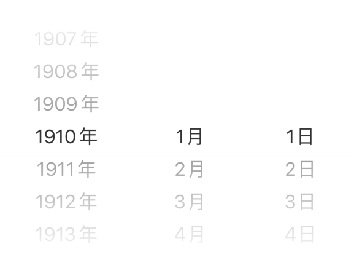
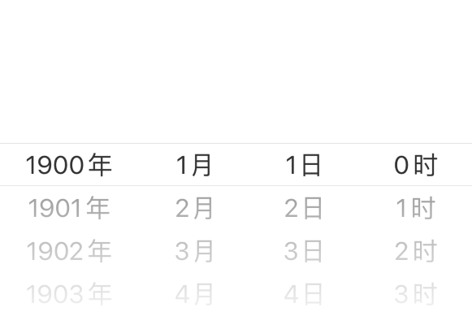
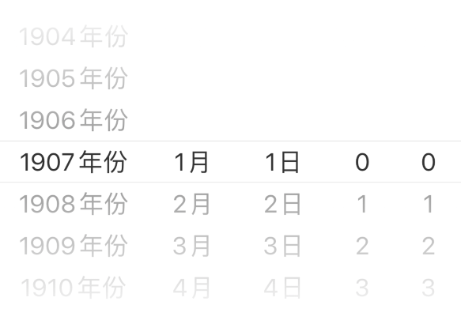

# DatePickerView 日期选择

用于选择日期或者时间，基于 PickerView 进行封装，根据 type 的不同有着多种选择形式

与 DatePicker 不同的是，它是直接渲染在区域中，而不是弹出窗口

```tsx
/**
 * inline: true
 */
import React from 'react';
import { Link } from 'react-router-dom';
import { Blockquote } from '@kealm/react-packages';

export default () => (
  <Blockquote title='TIP'>
    暂无仿真机示例，可参考 H5 组件库 <Link to='/react-mobile/data/date-picker-view'>DatePickerView</Link>
  </Blockquote>
);
```

```tsx
/**
 * inline: true
 */
import React from 'react';
import { Link } from 'react-router-dom';
import { Blockquote } from '@kealm/react-packages';

export default () => (
  <Blockquote title='WARNING' type='warning'>
    由于 PickerView 的实现上用到了定时器 setTimeout，在 Android 测试 PickerView 时请关闭 Chorme Debug JS Remotely，因为它会导致 setTimeout 失效。见 <a href='https://github.com/facebook/react-native/issues/9436' target='_blank'>issues</a>
  </Blockquote>
);
```

## 基本用法

常规的受控组件，由 `value` 与 `onChange` 进行受控选择



<code src='./demos/demo-base.tsx' />

## 最大、最小日期

DatePickerView 默认最小日期为 new Date('1900/01/01 00:00:00')，最大日期为当前时间 new Date()

可以通过配置 `minDate`、`maxDate` 自定义日期区间

```tsx
/**
 * inline: true
 */
import React from 'react';
import { Link } from 'react-router-dom';
import { Blockquote } from '@kealm/react-packages';

export default () => (
  <Blockquote title='WARNING' type='warning'>
    minDate、maxDate 请配置固定的时间，请勿传递如 new Date() 此类每次 render 都不同的值，这将引起无限 render
  </Blockquote>
);
```


<code src='./demos/demo-clamp.tsx' />

## 日期选择类型

DatePickerView 允许通过配置 `type` 来选择日期类型结构：

- `date`: 年、月、日

- `time`: 时、分

- `datetime`: 年、月、日、时、分

- `datehour`: 年、月、日、时

- `year`: 年

- `year-month`: 年、月

- `month-day`: 月、日

如下展示一个 “年、月、日、时” 的日期选择器



<code src='./demos/demo-type' />

## 自定义单位名称

DatePickerView 默认会为每一项显示单位名称：

- `years`: 年

- `month`: 月

- `date`: 日

- `hours`: 时

- `minutes`: 分

如果希望更改某一项的单位名称，可以通过配置 `unit` 进行修改，若不希望显示单位，可赋值为 null

```ts | pure
type UnitItemType = string | null;

interface Unit {
    year?: UnitItemType;
    month?: UnitItemType;
    date?: UnitItemType;
    hours?: UnitItemType;
    minutes?: UnitItemType;
}
```

如下，将 `year` 单位调整为 “年份”，并去除 `hours`、`minutes` 的单位名



<code src='./demos/demo-unit.tsx' />

## ref 与内置方法

DatePickerView 允许挂载 `ref` 并提供方法：

- `handleScroll`：手动驱动对应列滚动到当前 value 的位置

```ts
interface handleScroll {
    (
        line: 'year' | 'month' | 'date' | 'hours' | 'minutes',
        animated?: boolean,
    ) => void;
}
```

调用 `ref.current[method]` 即可触发

<code src='./demos/demo-ref.tsx' />

## API

| 参数 | 说明               | 类型         | 默认值 |
|------|--------------------|--------------|--------|
| styles   | 组件样式，可以覆盖任何默认样式                             | `object`                                                     | --                                                           |
| value    | 当前选中的日期                                             | `Date`                                                       | --                                                           |
| onChange | 日期改变时触发                                             | `(value: Date) => void`                                      | --                                                           |
| maxDate  | 最大日期                                                   | `Date`                                                       | `new Date()`                                                 |
| minDate  | 最小日期                                                   | `Date`                                                       | `new Date('1900/01/01 00:00:00')`                            |
| type | 日期类型 | `enum('date', 'time', 'datetime', 'datehour', 'year', 'year-month', 'month-day')` | `'date'` |
| unit | 年、月、日、时、分项的单位名称，配置为 null 则不会显示单位 | `{ year?: string \| null; month?: string \| null; date?: string \| null; hours?: string \| null; minutes?: string \| null}` | `{ year: '年', month: '月', date: '日', hours: '时', minutes: '分' }` |

除了默认配置项，还可以传递 [ViewProps](https://reactnative.cn/docs/view)，将作用在组件根元素上，如

- style
