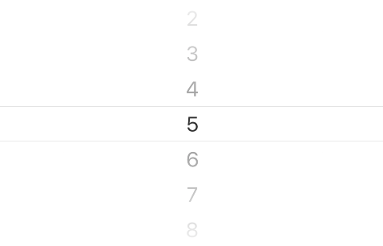
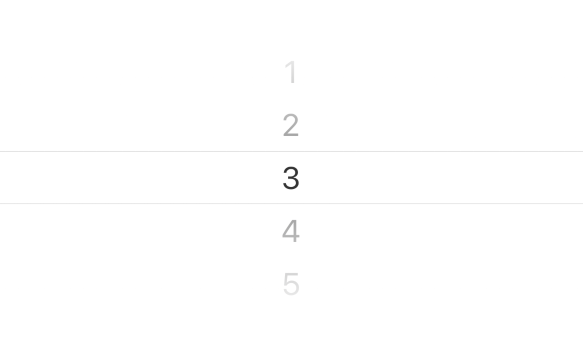

# PickerView 选择器

最基本的选择器，与 Picker 不同的是，它是直接渲染在区域中，而不是弹出窗口

```tsx
/**
 * inline: true
 */
import React from 'react';
import { Link } from 'react-router-dom';
import { Blockquote } from '@kealm/react-packages';

export default () => (
  <Blockquote title='TIP'>
    暂无仿真机示例，可参考 H5 组件库 <Link to='/react-components/data/picker-view'>PickerView</Link>
  </Blockquote>
);
```

```tsx
/**
 * inline: true
 */
import React from 'react';
import { Link } from 'react-router-dom';
import { Blockquote } from '@kealm/react-packages';

export default () => (
  <Blockquote title='WARNING' type='warning'>
    由于 PickerView 的实现上用到了定时器 setTimeout，在 Android 测试 PickerView 时请关闭 Chorme Debug JS Remotely，因为它会导致 setTimeout 失效。见 <a href='https://github.com/facebook/react-native/issues/9436' target='_blank'>issues</a>
  </Blockquote>
);
```

## 基本用法

通过 `data` 配置选项列表，`value`、`onChange` 进行受控



<code src='./demos/demo-base.tsx' />

## 视图区域显示数量

默认情况下，PickerView 在视图区域内最多可以展示 7 个 Item（中间 1 项 + 上下各 3项）

配置 `sideCount` 即可自定义可见 Item 的数量



<code src='./demos/demo-count.tsx' />

## ref 与内置方法

PickerView 允许挂载 `ref` 并提供方法：

- `handleScroll`：执行后将触发组件滚动到 selectedValue 的位置，通常在 Item 列表突变不能自适应调节滚动位置时使用

```ts
interface handleScroll {
    (animated?: boolean): void;
}
```

调用 `ref.current[method]` 即可触发

<code src='./demos/demo-ref.tsx' />

## API

### PickerView

| 参数 | 说明               | 类型         | 默认值 |
|------|--------------------|--------------|--------|
| styles        | 组件样式，可以覆盖任何默认样式                               | `object`                              | --     |
| selectedValue | 当前选中项的值                                               | `any`                                 | --     |
| onValueChange | 选中值改变时触发                                             | `(value: any, index: number) => void` | --     |
| sideCount     | 两侧的 item 显示数量，默认整个 picker 能显示7 项（中间 1 项 + 上下各 3项） | `number`                              | `3`    |
| animated      | 滚动是否有动画                                               | `boolean`                             | `true` |

除了默认配置项，还可以传递 [ViewProps](https://reactnative.cn/docs/view)，将作用在组件根元素上，如

- style

### PickerView.Item

| 参数 | 说明               | 类型         | 默认值 |
|------|--------------------|--------------|--------|
| value | item 项的值                                                  | `any`                | --     |
| label | item 项显示的内容，通常是 string，可以是自定义的 ReactNode，但需要确保每一项的高度是一致的 | `string / ReactNode` | --     |

## Theme

| **变量名** | **对应基础主题**     | **值**    |
|--------------|--------|--------------------|
| c_picker_view_item_height            |                      | `34`                                                        |
| c_picker_view_item_grandient_top     |                      | `['rgba(255, 255, 255, 0.95)', 'rgba(255, 255, 255, 0.5)']` |
| c_picker_view_item_grandient_bottom  |                      | `['rgba(255, 255, 255, 0.5)', 'rgba(255, 255, 255, 0.95)']` |
| c_picker_view_background_color       | `color_white`        | `'#fff'`                                                    |
| c_picker_view_font_size              | `font_size_XXXXL`    | `20`                                                        |
| c_picker_view_text_color             | `color_text_primary` | `'#323232'`                                                 |
| c_picker_view_indicator_border_color | `border_color_dark`  | `'#cecece'`                                                 |