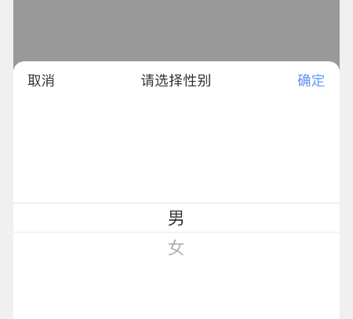

# Picker 选择器

常用的弹框选择器（暂不支持多列，有需要可以使用 Drawer + PickerView 实现）

```tsx
/**
 * inline: true
 */
import React from 'react';
import { Link } from 'react-router-dom';
import { Blockquote } from '@kealm/react-packages';

export default () => (
  <Blockquote title='TIP'>
    暂无仿真机示例，可参考 H5 组件库 <Link to='/react-components/data/picker'>Picker</Link>
  </Blockquote>
);
```

```tsx
/**
 * inline: true
 */
import React from 'react';
import { Link } from 'react-router-dom';
import { Blockquote } from '@kealm/react-packages';

export default () => (
  <Blockquote type='warning' title='WARNING'>
      <p>Picker 底层由 Pop 组件实现，不要忘记在页面最外层包装 {`<PortalWrapper>`}</p>
      <Link to='/rn-components/basic/pop#顶层-portalwrapper'>什么是 PortalWrapper？</Link>
  </Blockquote>
);
```

```tsx
/**
 * inline: true
 */
import React from 'react';
import { Link } from 'react-router-dom';
import { Blockquote } from '@kealm/react-packages';

export default () => (
  <Blockquote title='WARNING' type='warning'>
    由于 PickerView 的实现上用到了定时器 setTimeout，在 Android 测试 PickerView 时请关闭 Chorme Debug JS Remotely，因为它会导致 setTimeout 失效。见 <a href='https://github.com/facebook/react-native/issues/9436' target='_blank'>issues</a>
  </Blockquote>
);
```

## 基本用法

最基本的选择器使用

- `data` 自定义列表数据

- `visible`、`onVisibleChange` 控制 Picker 显示隐藏

- `value`、`onChange` 使 Picker 受控


<code src='./demos/demo-base.tsx' />

## 默认选中项

当初始 `value` 为空值（undefined）时，我们可能希望 Picker 默认展示的不是第一项，而是其他项作为默认值

这种场景下可以配置 `defaultValue` 作为默认选中项，如下默认选择 '女'


<code src='./demos/demo-default.tsx' />

## 自定义标题

配置 `title` 即可展示引导性标题



<code src='./demos/demo-title.tsx' />

## 取消、确定按钮文本

Picker 允许更改取消、确定按钮的文本，只需配置 `cancelText`、`okText`

并且提供了 `onCancel`、`onOk` 事件方便在点击按钮后执行所需的行为


<code src='./demos/demo-btn-text.tsx' />


## 支持 PickerView 组件配置

Picker 继承至 PickerView，这意味着 Picker 支持 [PickerView](/rn-components/data/picker-view#api) 组件的配置

如配置 Picker 为：

- sideCount 为 2

<code src='./demos/demo-picker-view.tsx' />

## 支持 Drawer 组件配置

Picker 基于 PickerView + Drawer 封装，组件提供了 `DrawerProps` 配置

而 Drawer 又是基于 Pop 封装，这意味着 Picker 支持 [Drawer](/rn-components/feedback/drawer#api) + [Pop](/rn-components/basic/pop#api) 的全部配置

如配置 Picker 为：

- 在打开完毕后的事件 `afterOpen` 进行吐司

<code src='./demos/demo-drawer.tsx' />

## API

| 参数 | 说明               | 类型         | 默认值 |
|------|--------------------|--------------|--------|
| styles           | 组件样式，可以覆盖任何默认样式 | `object`                                           | --       |
| PickerViewStyles | Picker 组件样式                | `object`                                           | --       |
| data             | 选择的列表项                   | `Array<{ label: string / ReactNode; value: any }>` | --       |
| defaultValue     | 初始 Picker 打开时选中的默认值 | `any`                                              | --       |
| value            | 当前选中的值                   | `any`                                              | --       |
| onChange         | 点击确定时触发                 | `(value: any) => void`                             | --       |
| visible          | picker 是否显示                | `boolean`                                          | --       |
| onVisibleChange | picker 可见状态改变时触发 | `(v: boolean) => void` | -- |
| title | 标题 | `string / ReactNode` | -- |
| cancelText | 取消按钮 | `string / ReactNode` | `'取消'` |
| onCancel | 点击取消按钮的回调 | `() => void` | -- |
| okText | 确定按钮 | `string / ReactNode` | `'确定'` |
| onOk | 点击确定按钮的回调 | `(value: any) => void` | -- |
| drawerProps | Drawer 组件的 Props | [DrawerProps](/rn-components/feedback/drawer#api) | -- |

除了默认配置项，Picker 继承至 `PickerView` 组件，还可以传递 [PickerViewProps](/rn-components/data/picker-view#api)，如

- sideCount

## Theme

|  | **变量名** | **对应基础主题**     | **值**    |
|--------------------|--------------|--------|--------|
| Default | c_picker_radius                 |                      | `12`        |
|         | c_picker_background_color       | `color_white`        | `'#fff'`    |
| Header  | c_picker_header_height          |                      | `44`        |
|         | c_picker_header_border_color    | `border_color_base`  | `'#e8e8e8'` |
| Title   | c_picker_title_height           |                      | `44`        |
|         | c_picker_title_font_size        | `font_size_XL`       | `16`        |
|         | c_picker_title_text_color       | `color_text_primary` | `'#323232'` |
| Btn     | c_picker_btn_height             |                      | `44`        |
|         | c_picker_btn_padding_horizontal |                      | `16`        |
|         | c_picker_btn_font_size          | `font_size_XL`       | `16`        |
|         | c_picker_btn_text_color         | `color_text_primary` | `'#323232'` |
|         | c_picker_btn_ok_text_color      | `color_primary`      | `'#4794ff'` |
| View    | c_picker_view_padding_vertical  |                      | `16`        |
